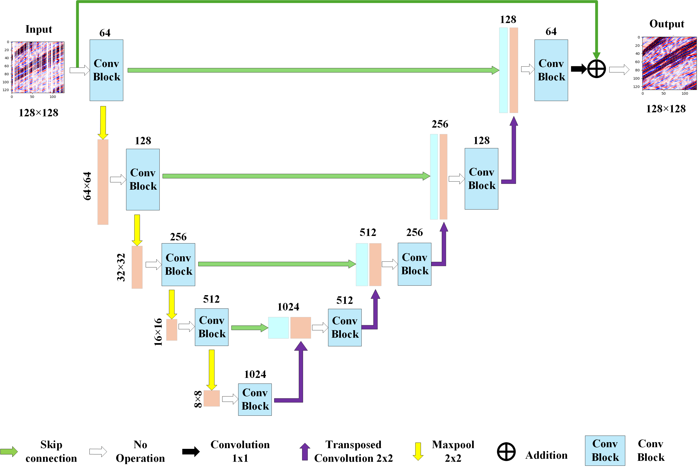
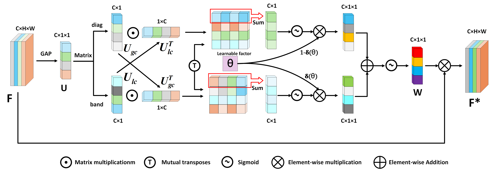

# AFCAU-net

<!-- PROJECT LOGO -->
<br />

<p align="center">
  
</p>

<h3 align="center">AFCAU-net Framework</h3>

<p align="center">
  
</p>

<h3 align="center">Conv Block</h3>

<p align="center">
  <a href="https://gitee.com/lose_recall/ubrfc-net">
    
  </a>
</p>

<h3 align="center">Adaptive Fine-Grained Channel Attention</h3>

<p align="center">
  <a href="https://gitee.com/lose_recall/ubrfc-net"></a>
</p>


### Experimental Environment

| Software/Hardware | Configuration |
|------|---------------------------------------|
| System | Windows 11 |
| Python | 3.10 |
| PyTorch | 2.4.0 |
| CUDA | 11.8 |
| CPU | 12th Gen Intel(R) Core (TM) i9-12900H |
| GPU | NVIDIA GeForce RTX 3060 Laptop |
| RAM | 16GB |

### Filetree
```
│
├─images
│      AFCAU-Net.png
│      Conv Block.png
│      FCA.png 
│      NH_00.png
│      Outdoor_00.png
│
├─model
│      AFCAU-net.py
│      test.py
│      train.py
│
├─utils
│      Sgy2Npy.py
│      GP.py
│      dataset.py
│
├─LICENSE
└─README.md

```
### Dataset

The synthetic dataset is sourced from the following websites:
https://wiki.seg.org/wiki/2007_BP_Anisotropic_Velocity_Benchmark
The actual dataset is sourced from the following website:
https://walrus.wr.usgs.gov/namss/survey/p1-13-la-walker-ridge/

### Train

```shell
python train.py 
```

### Test

 ```shell
python test.py 
 ```


### Qualitative Results

#### Synthetic seismic data with 60% randomly missing traces and their reconstruction results with errors: (a) Original data; (b) 60% randomly missing; (c) U-Net reconstruction result; (d) AFCAU-Net reconstruction result; (e) U-Net reconstruction error; (f) AFCAU-Net reconstruction error.
<div style="text-align: center">

</div>

#### Randomly missing 60% of real seismic data traces and their reconstruction results with errors: (a) Original data; (b) Randomly missing 60%; (c) U-Net reconstruction results; (d) AFCAU-Net reconstruction results; (e) U-Net reconstruction error; (f) AFCAU-Net reconstruction error.
<div style="text-align: center">

</div>

<div align="left">
</div> 

### Thanks

We would like to express our sincere gratitude to the researchers, developers, and academic community whose pioneering work made this project possible.
